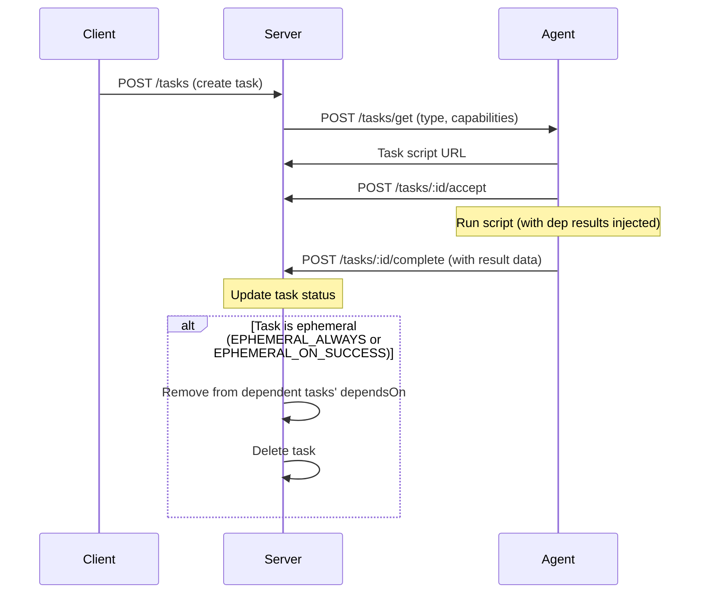
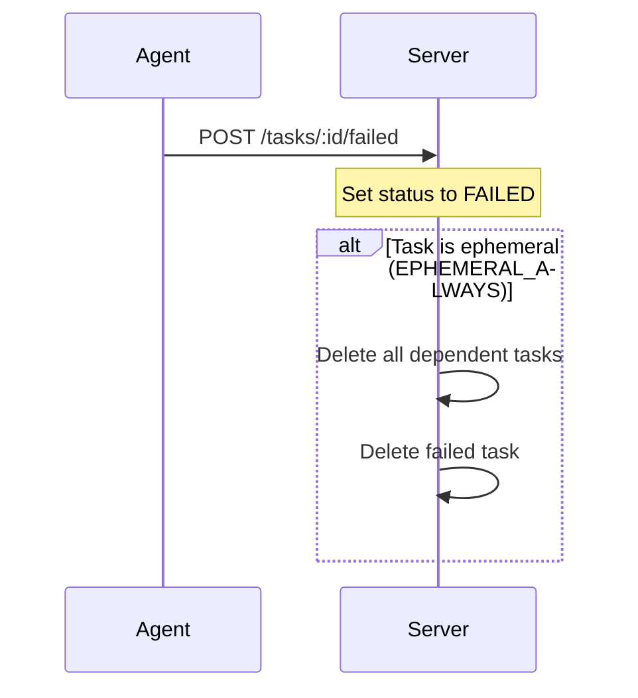

# SheetBot Internal

A TypeScript-based automation and task management system using Deno.

## Features

- Distributed runtime for executing tasks
- SQLite data providers for sheets and users
- Web interface for managing sheets and tasks
- Various utility scripts for different operations

## Getting Started

1. Ensure Deno is installed
2. Run the main server: `deno run --allow-all main.ts`
3. Access the web interface at the configured port

## Scripts

Various scripts are available in the `scripts/` directory for specific tasks like compilation, system operations, and examples.

## Protocol

The SheetBot protocol enables distributed task execution with dependency management and capability-based matching.

### Sequence Diagram



### Failure Handling



### Key Concepts

- **Tasks**: Units of work with scripts, dependencies, and capability requirements
- **Dependencies**: Tasks can depend on others; execution waits for all deps to complete
- **Capabilities**: JSON Schema matching for agent selection
- **Ephemeral Tasks**: Auto-deleted after completion for cleanup
- **Artefacts**: File outputs stored per task

### Data Management

#### Task Data

Tasks store arbitrary JSON data that can be updated during execution:

- **Update during execution**: Agents can POST to `/tasks/:id/data` to add/update data
- **Completion data**: Agents include result data in `/tasks/:id/complete` request
- **Dependency injection**: Completed task data is injected into dependent scripts using `__DEP_RESULT_<taskId>__` placeholders

Example: A compilation task might store build artifacts or error logs in its data.

#### Sheet Data

Sheets provide persistent key-value storage using SQLite databases:

- **Upsert data**: POST to `/sheets/:id/data` with JSON containing `key` and other fields
- **Delete row**: DELETE `/sheets/:id/data/:key`
- **Retrieve data**: GET `/sheets/:id` returns schema and all rows
- **Storage**: Each sheet is a SQLite DB file in `./sheets/` directory

Sheets are useful for storing shared state, results, or configuration across tasks.

#### Sheet Views

Sheets support customizable views through column metadata:

- **Column Structure**: Each sheet has a `columnstructure` table defining columns with properties like `widgettype`, `minwidth`, `maxwidth`, `minheight`, `maxheight`, and `columnorder`
- **Widget Types**: Columns specify a widget type (e.g., `text`, `image`, `code`, `download`) that determines how data is rendered in cells
- **Layout**: The web interface uses a CSS grid layout where each cell contains the appropriate widget based on column type
- **Multi-widgets**: Columns can specify an array of widget types for complex displays

Available widgets include:
- `text`: Plain text display
- `image`: Image rendering
- `code`: Syntax-highlighted code
- `download`: Downloadable files
- `sheetkey`: Key display
- `hashimg`: Hashed image
- `multi`: Multiple widgets in one cell
- `testresult`: Test result display

To customize a sheet's view, modify the `columnstructure` table via API or direct database access.

#### Adding New Widgets

To create a custom widget for sheet columns:

1. **Create Widget File**: Add `widget-<name>.js` in the `static/` directory
2. **Define Custom Element**: Create a class extending `HTMLElement` (or use LitElement)
3. **Implement Required Methods**:
   - `getCopyText()`: Return plain text for clipboard
   - `getCopyHTML()`: Return HTML for clipboard
   - `getContextMenuDefinition()`: Return array of context menu items
   - `delete()`: Handle deletion
4. **Handle Attributes**: Widget receives `data`, `datatype`, `rowkey` attributes
5. **Register Element**: Use `customElements.define('widget-<name>', WidgetClass)`
6. **Load in HTML**: Add `<script src="widget-<name>.js" type="module"></script>` to `sheet.html`
7. **Set in Column**: Update `columnstructure` table with `widgettype = '<name>'`

Example widget structure:

```javascript
class MyWidget extends HTMLElement {
    connectedCallback() {
        this.innerHTML = `<div>${this.getAttribute('data')}</div>`;
    }
    getCopyText() { return this.getAttribute('data'); }
    getCopyHTML() { return `<div>${this.getAttribute('data')}</div>`; }
    getContextMenuDefinition() { return []; }
    delete() { /* cleanup */ }
}
customElements.define('widget-my', MyWidget);
```

### Agent Workflow

1. Poll `/tasks/get` with agent type and capabilities
2. Receive task script URL if available
3. Accept task via `/tasks/:id/accept`
4. Execute script (dependencies injected as `__DEP_RESULT_<id>__`)
5. Report completion via `/tasks/:id/complete` with result data

## Project Structure

- `lib/`: Core libraries and data providers
- `scripts/`: Automation scripts
- `sheets/`: Generated sheet files
- `static/`: Web assets and HTML files