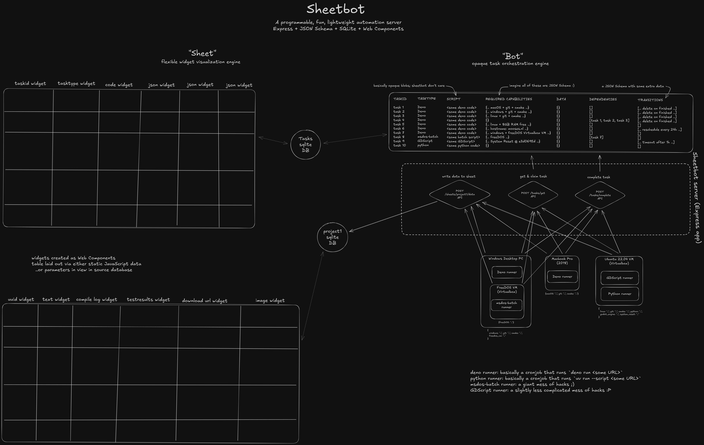
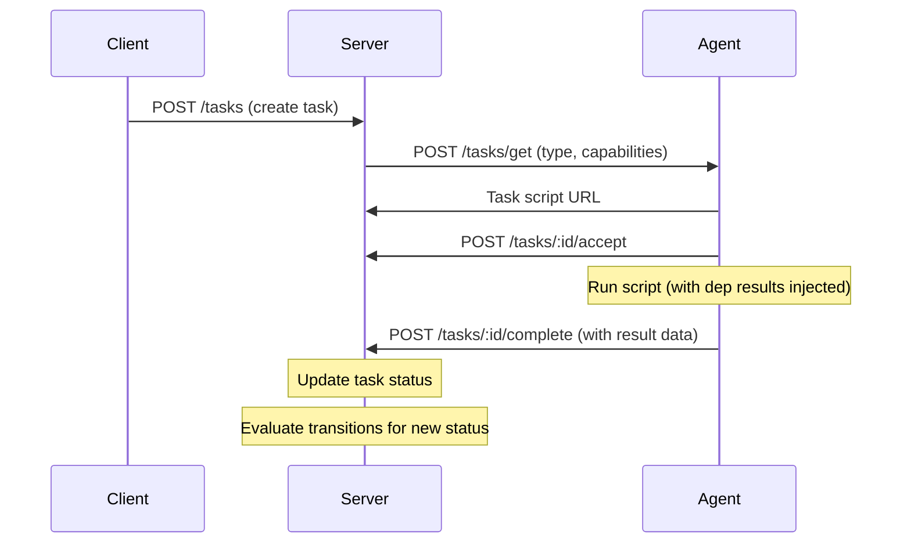
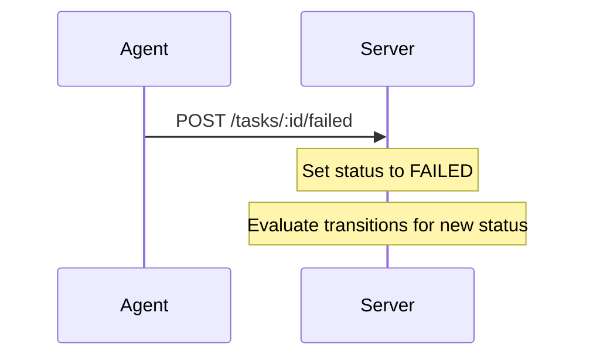
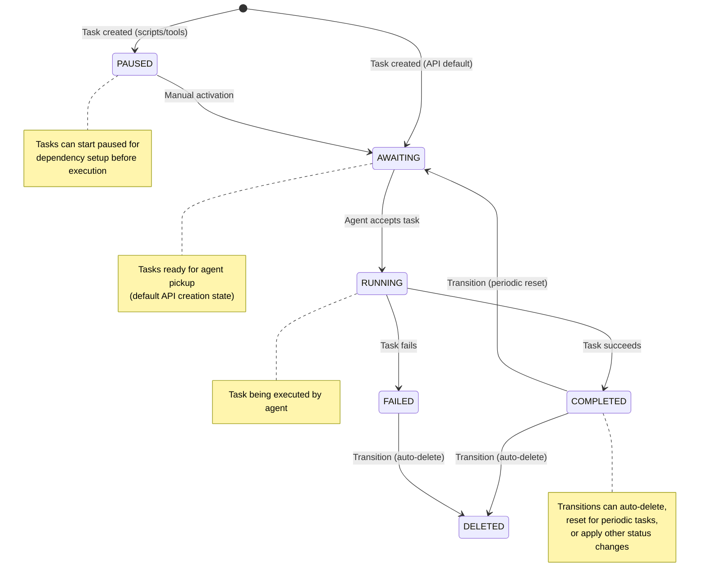
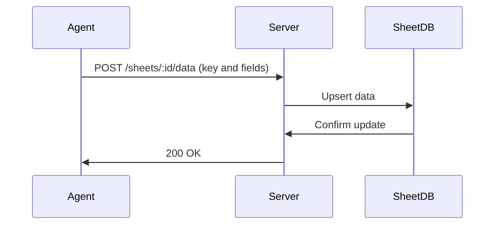

# SheetBot


An open-source automation and CI tool built with Deno, Express.js, SQLite, Web Components (Lit), and JSON Schema. SheetBot provides flexible task orchestration and a widget-based UI for visualization, enabling cross-platform builds, remote installations, and bespoke automation without heavy dependencies.

**For a detailed human-written account of SheetBot's development and philosophy, see: https://mooses.nl/blog/sheetbot_opensource_release/**

## Why I Built SheetBot

I needed a quick build system for testing modifications to my projects across Linux, Windows, and MacOS. Existing open-source CI systems had too many dependencies, strong opinions on configuration, weak cross-platform support, and weren't designed for pet-like machines or extensibility through code. SheetBot solves these by using SQLite for storage, JSON Schema for task matching, and opaque scripts that can be written in any language.

## Philosophy

SheetBot embraces "primitive emergent architecture": simple primitives (tasks, schemas, widgets) that combine into powerful systems. It's designed for configuration as code, easy extensibility, and integration with diverse environments. Tasks are opaque to SheetBot, allowing scripts in any language with custom runners. The API is simple; add a new runner with a few hours of work or an AI prompt.

Built with familiar tools: Express, JSON Schema, SQLite and Web Components. No complex dependencies, no complex build tooling, no opinions on build scripts, just flexible automation and the ability to get started with a simple `git clone` and `deno run` command.

SheetBot is unlikely to be as easy to learn and use compared to existing CI tools, but once you understand how it works and how things fit together, it should be far easier to modify it to suit your needs. For me personally, that has saved time in the long run.

## Conceptual architecture



## Features

- **Flexible Task Orchestration**: Tasks with arbitrary scripts matched to agents via JSON Schema capabilities
- **Distributed Runtime**: Agents poll for tasks based on type and capabilities (e.g., OS, memory, installed software)
- **Widget-Based UI**: HTML table interface with customizable widgets for data visualization (text, images, code, downloads)
- **Opaque Scripts**: Run tasks in any language: Deno, Python, Bash, or custom runners
- **Dependency Management**: Tasks can depend on others which blocks them until the others complete
- **Artefacts & Data Storage**: File uploads and SQLite-backed sheets for persistent data
- **Transitions**: Automatable task status changes (e.g., auto-delete, periodic resets)
- **Cross-Platform**: Works on diverse hardware from Raspberry Pis to gaming handhelds
- **Extensibility**: Modify code for custom auth, endpoints, widgets, or task types

See [Distributed Runtime](docs/Distributed_Runtime.md) for info on an experimental distributed runtime system that's also included.

## Getting Started

1. Ensure Deno is [installed](https://docs.deno.com/runtime/getting_started/installation/), then clone this repository
2. Add a user via `deno run adduser.ts` - this will prompt you first for read and write access to files like the user database file; read through them and accept if you agree, then type in the username and password to generate a new user. Use `*` for permissions to give access to all features, or see [docs/permissions.md](docs/permissions.md) for more info on the permissions system.
3. Run the main server: `deno run --allow-read=./static --allow-read=./secret.txt --allow-read=./users.db --allow-write=./users.db --allow-read=./tasks.db --allow-write=./tasks.db --allow-read=./artefacts/ --allow-write=./artefacts/ --allow-read=./sheets/ --allow-write=./sheets/ --allow-read=./library/ --allow-read=./scripts/ --allow-read=./init/ main.ts` - this will again prompt for a few extra permissions; read through them and accept if you agree.
4. Access the web interface at http://localhost:3000/

By default, SheetBot listens on all interfaces (`0.0.0.0`) - change this in `main.ts` as needed.

## Initialization

SheetBot includes an initialization system that runs TypeScript scripts on every startup. Place `.ts` files in the `./init/` directory; they will be executed in lexicographic order based on their filenames. Scripts can export a default async function for asynchronous initialization tasks.

Example init script (`./init/01_setup_db.ts`):

```typescript
export default async function() {
    // Initialize database or other setup
    console.log("Initializing database...");
    // async operations here
}
```

This is useful for setting up databases, loading configurations, or performing other startup tasks.

## Scripts

- **`scripts/` directory**: Contains agent template files (`agent.template.ts`, `agent.template.py`, `agent.template.sh`)
- **`library/` directory**: Contains automation scripts for various use cases (game development, web deployment, system automation, etc.)

### Library Script Annotations

Library scripts use special XML-like annotations in comments to define task metadata. See [Library Script Annotations](docs/library_script_annotations.md) for details on how to use `<name>`, `<capabilitiesSchema>`, `<data>`, and `<addTaskComments>` annotations.

## Protocol

The SheetBot protocol enables distributed task execution with dependency management and capability-based matching.

### Sequence Diagram



### Failure Handling



### Task State Diagram



### Key Concepts

- **Tasks**: Units of work with scripts, dependencies, and capability requirements
- **Dependencies**: Tasks can depend on others; execution waits for all deps to complete
- **Capabilities**: JSON Schema matching for agent selection
- **Transitions**: Timed status changes for tasks (e.g., auto-delete, periodic reset)
- **Artefacts**: File outputs stored per task
- **Runner Types**: SheetBot is agnostic to execution environments; it provides task management API while runners handle actual script execution

### Transitions

Transitions enable automated status changes for tasks based on time and conditions:

- **Configuration**: Tasks include a `transitions` array with status change rules
- **Evaluation**: Transitions are checked when task status changes or at scheduled intervals
- **Use Cases**: Auto-deletion after completion, periodic task resets, timeouts for awaiting tasks
- **Condition Matching**: JSON Schema validation against the entire task object (including id, name, script, status, data, artefacts, dependsOn, transitions, type, capabilitiesSchema)
- **Data Mutations**: Optional `dataMutations` object to update task data when transitioning
- **Timing**: Immediate evaluation or periodic checks (e.g., every 1h, 30m, 1s)

Example transition for auto-deleting completed tasks after 1 hour:

```json
{
  "statuses": ["COMPLETED"],
  "condition": {},
  "timing": {"every": "1h", "immediate": false},
  "transitionTo": "DELETED"
}
```

Example transition with condition and data mutation:

```json
{
  "statuses": ["COMPLETED"],
  "condition": {
    "type": "object",
    "properties": {
      "data": {
        "type": "object",
        "properties": {
          "errorCount": {"type": "number", "maximum": 5}
        }
      }
    }
  },
  "timing": {"immediate": true},
  "transitionTo": "AWAITING",
  "dataMutations": {"retryCount": 1}
}
```

### Artefacts

Artefacts are file outputs associated with tasks, stored in the filesystem for persistence and sharing.

- **Storage**: Files are stored in `./artefacts/tasks/{taskId}/` directories
- **Uploading**: Agents can upload artefacts during execution via POST `/tasks/{id}/artefacts` with multipart/form-data
- **Accessing**: Artefacts are accessible via GET `/tasks/{id}/artefacts/{filename}` which redirects to the direct file URL
- **Listing**: Artefacts are listed in the task's `artefacts` array
- **Deletion**: Individual artefacts can be deleted via DELETE `/tasks/{id}/artefacts/{filename}`
- **Cloning**: When tasks are cloned, artefacts are copied to the new task directory

#### Capabilities

See [Capabilities](docs/capabilities.md) for the full capabilities system documentation.

Capabilities enable fine-grained agent selection using JSON Schema validation:

- **Task Schema**: Tasks specify `capabilitiesSchema` (JSON Schema) defining required agent capabilities
- **Agent Capabilities**: Agents send a `capabilities` JSON object when polling `/tasks/get`
- **Matching**: Server validates agent capabilities against task schema using AJV
- **Static Capabilities**: Fixed properties like OS, CPU architecture, available tools
- **Dynamic Capabilities**: Runtime-computed properties like current load, available memory, network status

Example task schema requiring Linux with Node.js:

```json
{
  "type": "object",
  "properties": {
    "os": { "const": "linux" },
    "nodeVersion": { "type": "string" }
  },
  "required": ["os", "nodeVersion"]
}
```

Agents with matching capabilities (e.g., `{"os": "linux", "nodeVersion": "18.0.0"}`) can execute the task.

Task designers have full control over `capabilitiesSchema`; SheetBot enforces no predefined schemas, allowing complete customization for agent matching.

#### Setting Up Dynamic Capabilities

Agents can use a dynamic capabilities file to compute runtime capabilities like software versions, memory, and load averages. To set up:

1. **Download the capabilities library**:
   ```bash
   curl -o .capabilities.dynamic.ts <sheetbot_baseurl>/scripts/lib/capabilities.ts
   ```

2. **Or create a dynamic import file** `.capabilities.dynamic.ts`:
   ```typescript
   async function getCapabilities(staticCapabilities) {
       const lib = await import(Deno.env.get("SHEETBOT_BASEURL") + "/scripts/lib/capabilities.ts");
       return await lib.getCapabilities(staticCapabilities);
   }

   export { getCapabilities };
   ```

3. **Modify agent templates** to use the dynamic capabilities file by importing and calling `getCapabilities()` with static capabilities.

The dynamic capabilities include detected software versions (git, clang, cmake, etc.), OS details, memory info, load averages, and hostname.

### Data Management

#### Task Data

Tasks store arbitrary JSON data that can be updated during execution:

- **Update during execution**: Agents can POST to `/tasks/:id/data` to add/update data
- **Completion data**: Agents include result data in `/tasks/:id/complete` request
- **Dependency injection**: Completed task data is injected into dependent scripts using `__DEP_RESULT_<taskId>__` placeholders

Example: A compilation task might store build artifacts or error logs in its data.

#### Dependency Injection

When serving task scripts, SheetBot injects dependency results:

- **Placeholders**: Use `__DEP_RESULT_<taskId>__` in scripts
- **Injection**: Server replaces placeholders with JSON-stringified `depTask.data.default` values
- **Usage**: Scripts can reference dependency outputs directly

Example script:
```typescript
const depResult = __DEP_RESULT_abc123__; // Becomes actual data
console.log(depResult);
```

#### Sheet Data

Sheets provide persistent key-value storage using SQLite databases:

- **Upsert data**: POST to `/sheets/:id/data` with JSON containing `key` and other fields
- **Delete row**: DELETE `/sheets/:id/data/:key`
- **Retrieve data**: GET `/sheets/:id` returns schema and all rows
- **Storage**: Each sheet is a SQLite DB file in `./sheets/` directory

Sheets are useful for storing shared state, results, or configuration across tasks.

### Sheet Updates During Tasks

Tasks can update sheet data during execution:



#### Sheet Views

Sheets support customizable views through column metadata:

- **Column Structure**: Each sheet has a `columnstructure` table defining columns with properties like `widgettype`, `minwidth`, `maxwidth`, `minheight`, `maxheight`, and `columnorder`
- **Widget Types**: Columns specify a widget type (e.g., `text`, `image`, `code`, `download`) that determines how data is rendered in cells
- **Layout**: The web interface uses a CSS grid layout where each cell contains the appropriate widget based on column type
- **Multi-widgets**: Columns can specify an array of widget types for complex displays

Available widgets include:
- `text`: Plain text display
- `image`: Image rendering
- `code`: Syntax-highlighted code
- `download`: Downloadable files
- `sheetkey`: Key display
- `hashimg`: Hashed image
- `multi`: Multiple widgets in one cell
- `testresult`: Test result display

To customize a sheet's view, modify the `columnstructure` table via API or direct database access.

#### Adding New Widgets

To create a custom widget for sheet columns:

1. **Create Widget File**: Add `widget-<name>.js` in the `static/` directory
2. **Define Custom Element**: Create a class extending `HTMLElement` (or use LitElement)
3. **Implement Required Methods**:
   - `getCopyText()`: Return plain text for clipboard
   - `getCopyHTML()`: Return HTML for clipboard
   - `getContextMenuDefinition()`: Return array of context menu items
   - `delete()`: Handle deletion
4. **Handle Attributes**: Widget receives `data`, `datatype`, `rowkey` attributes
5. **Register Element**: Use `customElements.define('widget-<name>', WidgetClass)`
6. **Load in HTML**: Add `<script src="widget-<name>.js" type="module"></script>` to `sheet.html`
7. **Set in Column**: Update `columnstructure` table with `widgettype = '<name>'`

Example widget structure:

```javascript
class MyWidget extends HTMLElement {
    connectedCallback() {
        this.innerHTML = `<div>${this.getAttribute('data')}</div>`;
    }
    getCopyText() { return this.getAttribute('data'); }
    getCopyHTML() { return `<div>${this.getAttribute('data')}</div>`; }
    getContextMenuDefinition() { return []; }
    delete() { /* cleanup */ }
}
customElements.define('widget-my', MyWidget);
```

### Agent Workflow

Agents poll for tasks based on their type and capabilities. SheetBot provides templates for common runners:

- **Deno Runner**: For TypeScript/JavaScript tasks (`type: "deno"`)
  - Template: `/scripts/agent.ts` or `/scripts/agent.js`
  - Executes scripts in Deno runtime
- **Python Runner**: For Python tasks (`type: "python"`)
  - Template: `/scripts/agent.py`
  - Executes scripts in Python environment
- **Bash Runner**: For shell script tasks (`type: "bash"`)
  - Template: `/scripts/agent.sh`
  - Executes scripts in Bash shell. Requires `curl` and `jq` to be installed.

Workflow:
1. Poll `/tasks/get` with agent type and capabilities
2. Receive task script URL if available
3. Accept task via `/tasks/:id/accept`
4. Execute script (dependencies injected as `__DEP_RESULT_<taskId>__`)
5. Report completion via `/tasks/:id/complete` with result data

Runner implementations are flexible; SheetBot only requires adherence to the polling and reporting protocol.

## Programmability and Extensibility

SheetBot is designed for easy extension through code modification. Key extension points:

- **Authentication**: Add custom middleware to `main.ts` for auth schemes (e.g., OAuth, LDAP)
- **New Endpoints**: Extend the Express app with additional routes
- **Data Providers**: Implement custom storage backends by extending data provider classes
- **Widgets**: Add new widget types as shown above
- **Task Types**: Support additional runner types by adding templates and logic

The codebase is structured for straightforward modifications. For authentication, simply insert relevant middleware before route definitions in `main.ts`.

## Project Structure

- `lib/`: Core libraries and data providers
- `scripts/`: Agent template files
- `library/`: Automation scripts
- `sheets/`: Generated sheet files
- `static/`: Web assets and HTML files