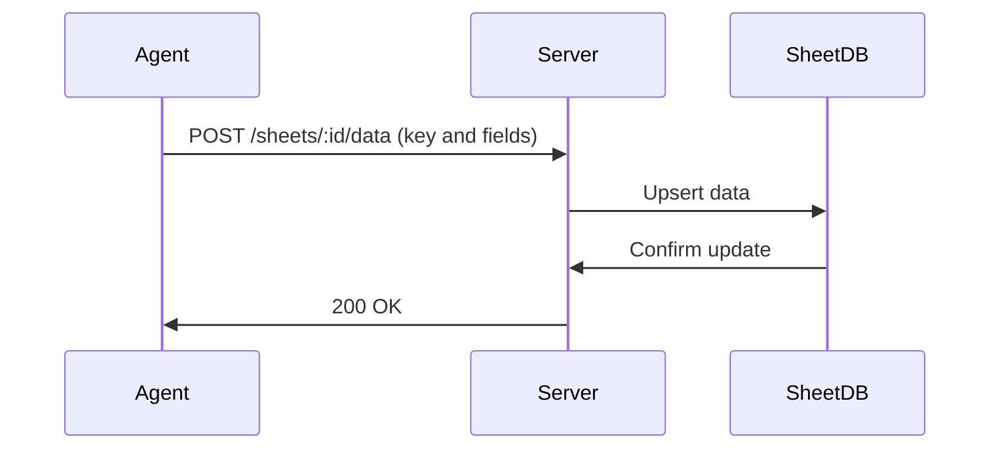

# Data Management

## Task Data

Tasks store arbitrary JSON data that can be updated during execution:

- **Update during execution**: Agents can POST to `/tasks/:id/data` to add/update data
- **Completion data**: Agents include result data in `/tasks/:id/complete` request
- **Dependency injection**: Completed task data is injected into dependent scripts using `__DEP_RESULT_<taskId>__` placeholders (`createInjectDependenciesMiddleware` in `lib/middleware.ts`)

Example: A compilation task might store execution time, success status, or warning counts in its data.

## Dependency Injection

When serving task scripts, SheetBot injects dependency results:

- **Placeholders**: Use `__DEP_RESULT_<taskId>__` in scripts
- **Injection**: Server replaces placeholders with JSON-stringified `depTask.data.default` values
- **Usage**: Scripts can reference dependency outputs directly

Example script:
```typescript
const depResult = __DEP_RESULT_abc123__; // Becomes actual data
console.log(depResult);
```

Note: Dependency injection is an advanced feature primarily used by the [distributed runtime](Distributed_Runtime.md). For most use cases, it's recommended to fetch task data dynamically at runtime using the API (e.g., GET `/tasks/{id}`), or have tasks communicate via shared sheets for better flexibility and decoupling.

## Sheet Data

Sheets provide persistent key-value storage using SQLite databases. See [Sheet Database Table Structure](sheet_db_tablestructure.md) for details on the underlying schema.

- **Upsert data**: POST to `/sheets/:id/data` with JSON containing `key` and other fields
- **Delete row**: DELETE `/sheets/:id/data/:key`
- **Retrieve data**: GET `/sheets/:id` returns schema and all rows
- **Storage**: Each sheet is a SQLite DB file in `./sheets/` directory

Sheets are useful for storing shared state, results, or configuration across tasks.

## Sheet Updates During Tasks

Tasks can update sheet data during execution:

