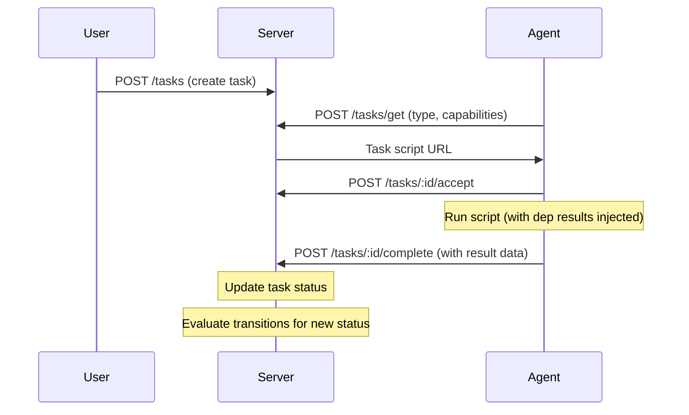
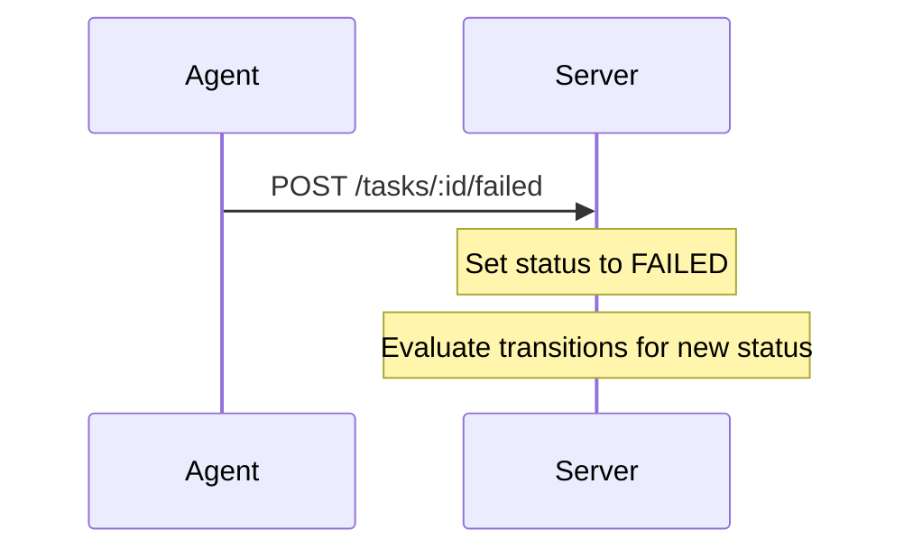
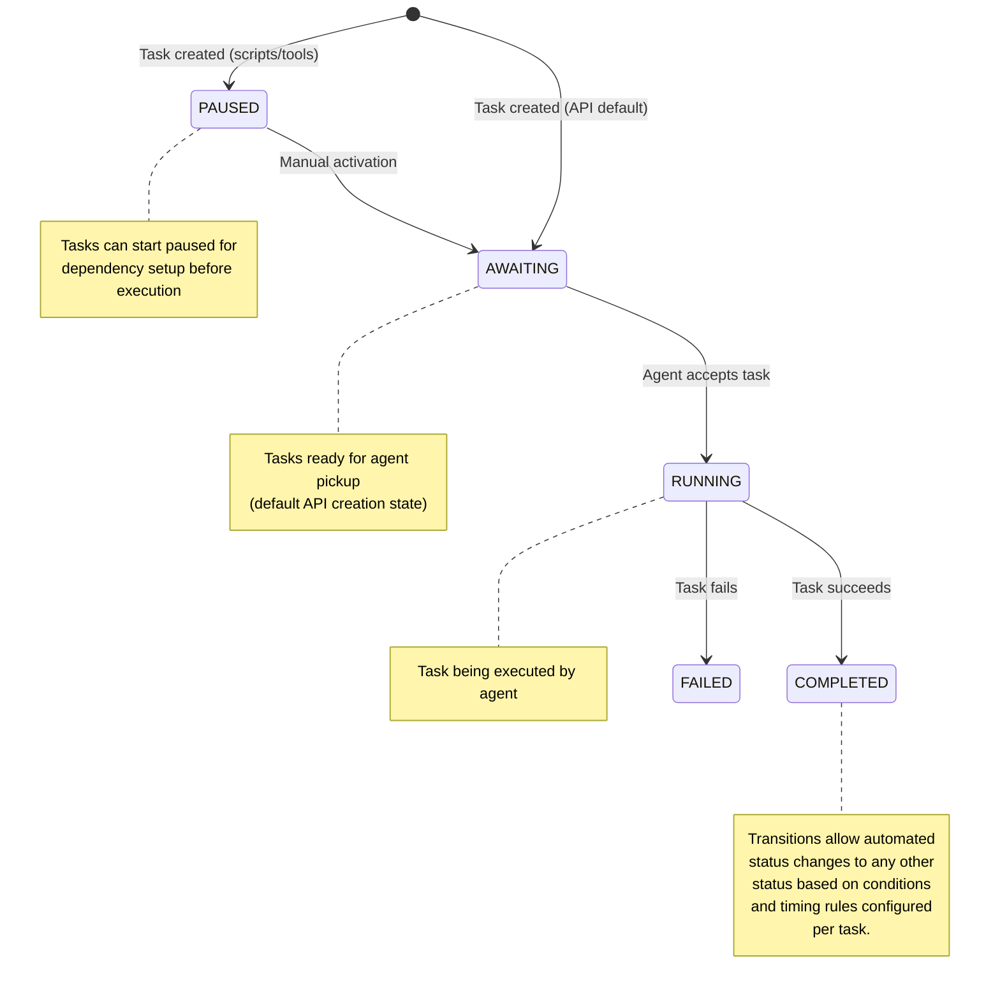

# Protocol

The SheetBot protocol enables distributed task execution with dependency management and capability-based matching.

## Sequence Diagram



## Failure Handling



## Task State Diagram



## Key Concepts

- **Tasks**: Units of work with scripts, dependencies, and capability requirements
- **Dependencies**: Tasks can depend on others; execution waits for all deps to complete
- **Capabilities**: JSON Schema matching for agent selection
- **Transitions**: Timed status changes for tasks (e.g., auto-delete, periodic reset)
- **Artefacts**: File outputs stored per task
- **Runner Types**: SheetBot is agnostic to execution environments; it provides task management API while runners handle actual script execution

## Transitions

Transitions enable automated status changes for tasks based on time and conditions:

- **Configuration**: Tasks include a `transitions` array with status change rules
- **Evaluation**: Transitions are checked when task status changes or at scheduled intervals
- **Use Cases**: Auto-deletion after completion, periodic task resets, timeouts for awaiting tasks
- **Condition Matching**: JSON Schema validation against the entire task object (including id, name, script, status, data, artefacts, dependsOn, transitions, type, capabilitiesSchema)
- **Data Mutations**: Optional `dataMutations` object to update task data when transitioning
- **Timing**: Immediate evaluation or periodic checks (e.g., every 1h, 30m, 1s)

Example transition for auto-deleting completed tasks after 1 hour:

```json
{
  "statuses": ["COMPLETED"],
  "condition": {},
  "timing": {"every": "1h", "immediate": false},
  "transitionTo": "DELETED"
}
```

Example transition with condition and data mutation:

```json
{
  "statuses": ["COMPLETED"],
  "condition": {
    "type": "object",
    "properties": {
      "data": {
        "type": "object",
        "properties": {
          "errorCount": {"type": "number", "maximum": 5}
        }
      }
    }
  },
  "timing": {"immediate": true},
  "transitionTo": "AWAITING",
  "dataMutations": {"retryCount": 1}
}
```

## Artefacts

See [Artefacts](artefacts.md) for details on file outputs, storage, and S3-compatible API.

## Capabilities

Capabilities enable fine-grained agent selection using JSON Schema validation:

- **Task Schema**: Tasks specify `capabilitiesSchema` (JSON Schema) defining required agent capabilities
- **Agent Capabilities**: Agents send a `capabilities` JSON object when polling `/tasks/get`
- **Matching**: Server validates agent capabilities against task schema using AJV
- **Static Capabilities**: Fixed properties like OS, CPU architecture, available tools
- **Dynamic Capabilities**: Runtime-computed properties like current load, available memory, network status

Example task schema requiring Linux with Node.js:

```json
{
  "type": "object",
  "properties": {
    "os": { "const": "linux" },
    "nodeVersion": { "type": "string" }
  },
  "required": ["os", "nodeVersion"]
}
```

Agents with matching capabilities (e.g., `{"os": "linux", "nodeVersion": "18.0.0"}`) can execute the task.

Task designers have full control over `capabilitiesSchema`; SheetBot enforces no predefined schemas, allowing complete customization for agent matching.

### Setting Up Dynamic Capabilities

Agents can use a dynamic capabilities file to compute runtime capabilities like software versions, memory, and load averages. To set up:

1. **Download the capabilities library**:
   ```bash
   curl -o .capabilities.dynamic.ts <sheetbot_baseurl>/scripts/lib/capabilities.ts
   ```

2. **Or create a dynamic import file** `.capabilities.dynamic.ts`:
   ```typescript
   async function getCapabilities(staticCapabilities) {
       const lib = await import(Deno.env.get("SHEETBOT_BASEURL") + "/scripts/lib/capabilities.ts");
       return await lib.getCapabilities(staticCapabilities);
   }

   export { getCapabilities };
   ```

3. **Modify agent templates** to use the dynamic capabilities file by importing and calling `getCapabilities()` with static capabilities.

The dynamic capabilities include detected software versions (git, clang, cmake, etc.), OS details, memory info, load averages, and hostname.